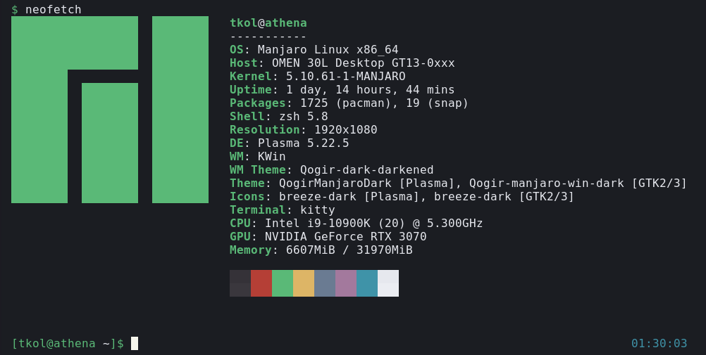
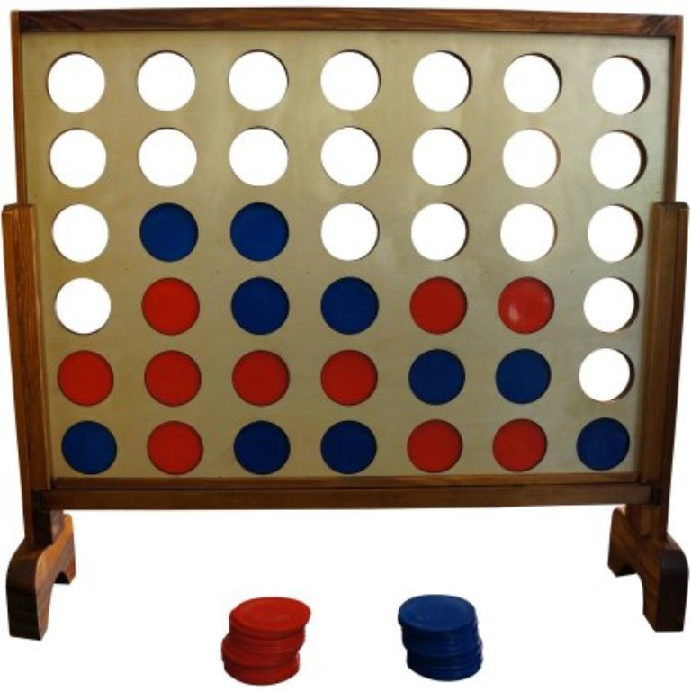
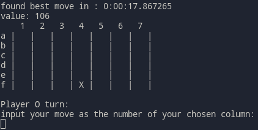
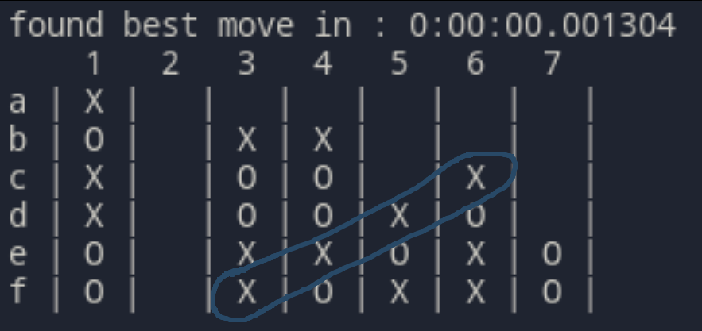
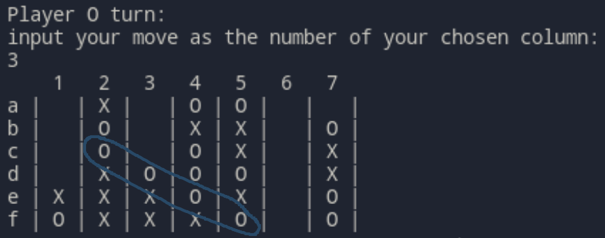
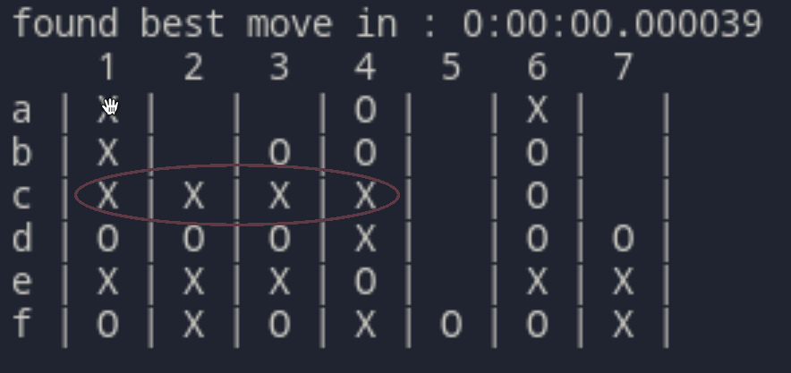
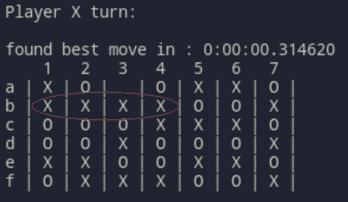
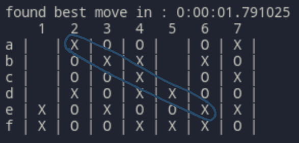
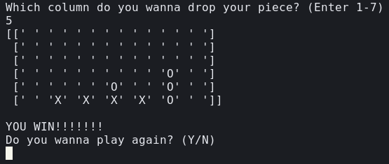

<H1 align="center">
Algoritmi di ricerca con avversari
<br>
</H1>

<p align="right"> Giorgio Strano - 1809528 </p>
<br>

### **Indice:**

- ### Introduzione, tecnologie e hardware

- ### Il gioco

- ### Ricerche complete
  - Minimax
  - Alpha / Beta Pruning

- ### Euristiche
- ### Diversi algoritmi
  - Monte Carlo Tree Search
  - AlphaZero

- ### Conclusioni

<br>
<br>


# Introduzione, tecnologie e hardware
<!-- <hr> -->

```
$ neofetch
```

La ricerca con avversari è un particolare tipo di ricerca dello spazio degli stati, che prevede la concorrenza di due agenti con obiettivi opposti.

Può essere rappresentata in modo intuitivo da un qualsisasi gioco da tavola per due partecipanti che giochino l'uno contro l'altro. Quando giochiamo, ad esempio, a Dama, cerchiamo con ogni mossa di migliorare la nostra posizione e peggiorare quella dell'avversario, tenendo conto del fatto che il nostro avversario farà lo stesso.

Gli algoritmi saranno implementati in Python 3.9 senza l'utilizzo di librerie di calcolo esterne (i.e. _numpy_), ed eseguiti senza accelerazione hardware o altri espedienti di ottimizzazione.  
Questo poiché l'unica efficienza rilevante ai fini del progetto è quella degli algoritmi, non delle implementazioni, e diverse scelte implementative porterebbero risultati inconsistenti.

Nel corso di questa relazione sarà riportato solo pseudocodice, il codice relativo ad ogni argomento può essere localizzato con gli `import` statements all'inizio di ogni paragrafo.  
Tutto il codice allegato è di mia proprietà, ad eccezione dei contenuti della cartella `AlphaZero_Connect4/` usata nell'ultimo paragrafo.


<p align="center">
  
</p>

<br>

# Il gioco scelto
<!-- <hr> -->

```
from game import Connect4
```
Per mettere in azione gli algoritmi trattati, ho deciso di implementare un semplice gioco: _Forza Quattro_, o in inglese _Connect 4_.


<p align="center">
  
</p>


Un turno consiste nel lasciar cadere in una colonna della tavola da gioco un tassello, che si posa su quello sottostante. Vince il primo giocatore a posizionare quattro tasselli adiacenti in verticale, orizzontale o diagonale. Nella figura sopra il giocatore rosso ha vinto inserendo un tassello nella prima colonna a sinistra.

Si presta bene ad essere usato come benchmarch poiché è un gioco ad informazione perfetta e somma-zero; inoltre la dimensione della plancia da gioco può variare, aumentando o diminuendo drasticamente il numero di scenari possibili in una partita.  

La qualità del gioco degli algoritmi sarà valutata in modo completamente arbitrario su una scala da 1 a 10: il livello 1 equivale a non conoscere le regole, 2 a fare mosse casuali, 9 a giocare consistentemente meglio di un qualsiasi umano non estremamente esperto e 10 a giocare perfettamente (Forza4 è infatti un gioco risolto).  
Per confronto, il voto che ho dato a me stesso giocando in modo piuttosto concentrato (dandomi tra i dieci e i venti secondi per pensare per turno) è di circa 7.5 (con un margine d'errore, poiché sono migliorato nel tempo portando avanti il progetto).

Ho incluso questa metrica per valutare il _"feel"_ di robustezza di ogni algoritmo, ovvero la sua potenza percepita da un punto di vista prettamente umano: non ha dunque alcuna intenzione di risultare come una misurazione scientifica. D'altronde un benchmark scientifico non è molto significativo in questo gioco, in cui (essendo completamente risolto) un giocatore perfetto è sempre in grado di vincere se gioca per primo.

Nel corso di tutti gli esperimenti il computer giocherà con il simbolo X, io con i cerchi (O).

Il gioco è implementato all'interno della classe `Connect4`, che fornisce metodi per giocare contro il computer dalla linea di comando.

Si può iniziare una partita con le due semplici operazioni:
```
game = Connect4(width=7, height=6)
game.newGame(starting_player=Player.X)
```
La logica che permette al computer di scegliere la mossa da fare è contenuta nel metodo ```findBestMove(self)``` .

<p align="center">
  
</p>

<br>
<br>


<!-- # Ricerche complete
<br> -->

# **Minimax**

  ```
  from minimax import minimax
  ``` 

  *Minimax*, nella sua forma più semplice, è un algoritmo di ricerca con avversari basato sul backtracking, applicabile a giochi a somma zero.

  Effettua una ricerca completa dello spazio degli stati basata su una supposizione: assegnando ad ogni stato finale un _valore di utilità_ $v$ (ad esempio, vittoria: 1, sconfitta: -1, pareggio: 0), possiamo assumere che così come il nostro agente (Max) vuole _massimizzare_ $v$, l'avversario (Min) lo voglia _minimizzare_.

  L'albero che rappresenta lo spazio degli stati viene dunque visitato assegnando ad ogni nodo:
  - Il valore massimo tra i valori dei nodi figli, se il nodo verrà attraversato al turno di Max.
  - Il valore minimo tra i valori dei nodi figli, se il nodo verrà attraversato al turno di Min.  
  

  Una volta completata la ricerca, l'algoritmo avrà trovato il percorso che permette di raggiungere il nodo foglia con il valore di utilità più alto che è possibile raggiungere supponendo che anche l'avversario ad ogni turno cerchi di raggiungere l'obiettivo opposto. 

  Pseudocodice:

  ```
  /* valuta e restituisce il valore di un nodo */
  minimax(nodo, turno_di_max):

    IF nodo è uno stato finale:
      RETURN valore di utilità di nodo

    /* max cerca il figlio che porti al valore massimo */
    IF turno_di_max:
      valore := -inf
      PER OGNI nodo figlio:
        valore := max(valore, minimax(nodo_figlio, False))
      RETURN valore
    
    /* min cerca il figlio che porti al valore minimo */
    IF NOT turno_di_max:
      valore := inf
      PER OGNI nodo figlio:
        valore := min(valore, minimax(nodo_figlio, True))
      return valore
  ```


  Poiché _Minimax_ effettua una ricerca completa, valuta ogni possibile scenario: è quindi computazionalmente impossibile da usare anche per trovare la prima mossa in una piccola griglia 4x4.

  Nel mio caso, l'esecuzione è stata fermata dopo ~15 minuti, e dopo avere esplorato ~6 milioni di stati, senza risultato.

  ### Voto: N/A

  <br>


 # **Minimax con alpha/beta pruning**

  ```
  from minimax import minimax_ab
  ``` 

  Un algoritmo di ricerca completa come quello descritto sopra esplora una grande quantità di rami dell'albero che non verranno mai raggiunti. 

  Ad esempio:  
  stiamo esplorando i figli del nodo _alpha_, che verrà raggiunto al turno di Max.  
  Il suo valore è quindi il _massimo_ dei valori dei nodi figli. Avendo trovato tra i figli di _alpha_ un nodo di valore 8, il valore di _alpha_ non potrà mai essere minore di 8.

  Avendo già però esplorato interamente _beta_, sappiamo che vale 6. Al turno precedente dunque il giocatore Min non sceglierà mai _alpha_ (che vale almeno 8) se può scegliere _beta_ (che vale 6), visto che Min cerca di minimizzare.  

  Sappiamo dunque che _alpha_ non sarà mai raggiunto, e possiamo smettere di esplorare i suoi figli.

  ```
              6               <--- turno di Min
            /   \
    (beta) 6     8 (alpha)    <--- turno di Max
          /|\    |\
         1 5 6   8 ...

  ```

  Da questa idea deriva l'algoritmo **Minimax con alpha/beta pruning**, che sfrutta questo principio per evitare di esplorare rami inutili.

  Pseudocodice:

  ```
  /* valuta e restituisce il valore di un nodo */
  minimax_ab(nodo, turno_di_max, alpha, beta):

    IF nodo è uno stato finale:
      RETURN valore di utilità di nodo

    /* max cerca il figlio che porti al valore massimo */
    IF turno_di_max:
      valore := -inf
      PER OGNI nodo figlio:
        valore := max(valore, minimax(nodo_figlio, False, alpha, beta))
        alpha := max(alpha, valore)
        IF alpha >= beta: BREAK
      RETURN valore
    
    /* min cerca il figlio che porti al valore minimo */
    IF NOT turno_di_max:
      valore := inf
      PER OGNI nodo figlio:
        valore := min(valore, minimax(nodo_figlio, True, alpha, beta))
        beta := min(beta, valore)
        IF alpha >= beta: BREAK
      return valore
  ```

  Con questa piccola modifica i tempi di esecuzione diminuiscono drasticamente. 

  Per trovare la prima mossa in una griglia 4x4 vengono esplorati solo 60184 possibili scenari in ~1 secondo.

  Trovare la prima mossa in una griglia 5x5 invece richiede ancora tempi troppo lunghi.

  ### Voto: 10 <small>(su griglie sufficientemente piccole)</small>, N/A <small>altrimenti</small>

<br>
<br>


## Aggiunta di euristiche
<hr>
<br>

Gli algoritmi visti fin'ora hanno un fondamentale problema in comune: nell'esplorazione dell'albero, devono giocare ogni partita fino alla fine per ottenere una valutazione di utilità, poiché gli unici stati in cui l'utilità può essere calcolata direttamente sono quelli finali, in cui la partita è vinta, persa o pareggiata.  

Se avessimo un modo per calcolare l'utilità di uno stato intermedio, ovvero asssegnare ad uno stato della partita un punteggio che determini chi dei due giocatori è in vantaggio e di quanto, l'algoritmo potrebbe esplorare l'albero solo fino ad una certa profondità, valutare l'utilità dei nodi (stati del gioco) a cui è arrivato, e poi procedere normalmente con la massimizzazione. 

Poiché le mosse necessarie per terminare una partita con una griglia 7x6 sono 42, già scendere di più di una decina di mosse in profondità permette di esplorare un numero enorme di stati, molti dei quali avranno punteggi di utilità sufficientemente alti da garantire di essere sulla strada di una vittoria. 

Possiamo dunque aggiungere ai nostri algoritmi funzioni _euristiche_ che calcolano il valore di utilità di uno stato intermedio della partita. La qualità di queste euristiche determina non solo la performance dell'algoritmo, ma anche lo stile di gioco scelto: un'euristica che premia le situazioni favorevoli più di quanto penalizzi per quelle sfavorevoli, ad esempio, comporterà uno stile di gioco molto più aggressivo, al contrario una che preveda grandi penalità per le situazioni di vantaggio dell'avversario porterà l'algoritmo a scegliere in media mosse più difensive.

<br>

## **Minimax alpha/beta con euristica**

Pseudocodice:
  ```
  /* valuta e restituisce il valore di un nodo */
  minimax_ab(nodo, depth, turno_di_max, alpha, beta, heur):

    IF nodo è uno stato finale:
      RETURN valore di utilità di nodo
    
    IF depth = 0:
      RETURN heur(nodo)

    /* max cerca il figlio che porti al valore massimo */
    IF turno_di_max:
      valore := -inf
      PER OGNI nodo figlio:
        valore := max (
            valore, 
            minimax(nodo_figlio, depth-1, False, alpha, beta, heur)
          )
        alpha := max(alpha, valore)
        IF alpha >= beta: BREAK
      RETURN valore
    
    /* min cerca il figlio che porti al valore minimo */
    IF NOT turno_di_max:
      valore := inf
      PER OGNI nodo figlio:
        valore := min (
          valore, 
          minimax(nodo_figlio, depth-1, True, alpha, beta, heur)
        )
        beta := min(beta, valore)
        IF alpha >= beta: BREAK
      return valore
  ```

  A differenza dei precedenti, questo algoritmo esplora l'albero solo fino ad una certa profondità. Una volta raggiunta, calcola il valore di utilità del nodo in cui si trova tramite la funzione euristica.  
  La scelta di questa funzione euristica è argomento dei prossimi paragrafi.

<br>


- ## **Prima euristica intuitiva**

  ```
  from minimax import minimax_ab_heur
  from heuristics import heuristic_one
  ``` 
  

  Questa prima euristica valuta lo stato della tabella di gioco in una maniera molto semplice ed intuitiva. Assegna infatti un punteggio calolato in funzione delle serie di pezzi vicini che il giocatore ha piazzato. 
  
  <br>

  Pseudocodice:

  ```
  heuristic_one(partita) 

    num_tre := serie di tre miei pezzi vicini
    num_due := serie di due miei pezzi vicini
    avv_tre := serie di tre pezzi vicini dell'avversario

    RETURN num_tre*100 - avv_tre*100 + num_due
  ```

  Essendo molto semplice, ha il vantaggio di essere molto rapida da calcolare: usando la griglia regolamentare 7x6, permette di scendere a profondità 10 in circa un minuto (per la prima mossa), a profondità 9 in ~20 secondi e a profondità 8 in ~3 secondi. 

  Questo significa che il Minimax con alpha/beta pruning e questa euristica è il primo algoritmo che gioca a Forza4 autonomamente ed in modo intelligente. 

  La qualità del gioco non è perfetta, ma sufficiente per sconfiggere un avversario umano un po' distratto.

  ### Voto a profondità 8: 6
  Se un umano giocasse così dirremmo che sa giocare e conosce le strategie di base, ma non è particolarmente bravo.  
  Riesce comunque a tendere trappole e doppi giochi (vedi sotto), e nella maggior parte dei casi impedisce la strategia dell'avversario. Tende a perdere se la partita dura molto, specialmente contro un giocatore attento.

  <p align="center">
    
    <figcaption align="center">
      <small>Coglie al volo una distrazione per vincere appena possibile</small>
    </figcaption>
  </p>


  ### Voto a profondità 9: 6.5
  Gioca nettamente meglio, impedendo quasi ogni attacco avversario. Se la partita va avanti in modo sfavorevole, spesso alza bandiera bianca e fa una mossa sbagliata piuttosto che giocare per il pareggio (vedi sotto).  
  Sconfiggerebbe in modo consistente un giocatore non allenato o non troppo concentrato.

  <p align="center">
    
    <figcaption align="center">
      <small>Si lascia sconfiggere inserendo il tassello nella colonna 3</small>
    </figcaption>
  </p>

<br>
<br>

- ## **Seconda euristica più complessa**
  ```
  from minimax import minimax_ab_heur
  from heuristics import heuristic_two
  ``` 

  Per migliorare la qualità della prima euristica, ho implementato un pattern matching più intelligente, che permette di cercare nella griglia di gioco sequenze di pezzi e spazi vuoti.  
  Una sequenza di tre pezzi adiacenti infatti non è utile se non può essere completata, e quindi deve avere almeno uno spazio libero ad un estremo (es: '- X X X O').  
  Una sequenza di tre pezzi con entrambi gli estremi liberi è poi ancora più preziosa.  
  La precedente euristica infine non valutava sequenze di tre pezzi con uno spazio vuoto al centro (es: "X - X X"), che sono vantaggiose almeno quanto quelle di tre pezzi consecutivi. 

  Pseudocodice:
  ```
  heuristic_due(partita) 

    p1 := contaPattern (pattern=' --- ', player=X)
    p2 := contaPattern (pattern='--- ', player=X)
    p3 := contaPattern (pattern=' ---', player=X)
    p4 := contaPattern (pattern='-- -', player=X)
    p5 := contaPattern (pattern='- --', player=X)
    p6 := contaPattern (pattern=' -- ', player=X)
    p7 := contaPattern (pattern='--  ', player=X)
    p8 := contaPattern (pattern='  --', player=X)
    p9 := contaPattern (pattern='-  -', player=X)

    o1 := contaPattern (pattern=' --- ', player=O) 
    o2 := contaPattern (pattern='--- ', player=O)  
    o3 := contaPattern (pattern=' ---', player=O)  
    o4 := contaPattern (pattern='-- -', player=O)  
    o5 := contaPattern (pattern='- --', player=O)  
    o6 := contaPattern (pattern=' -- ', player=O)  
    o7 := contaPattern (pattern='--  ', player=O)  
    o8 := contaPattern (pattern='  --', player=O)  
    o9 := contaPattern (pattern='-  -', player=O)  

    center_value =
      n. pezzi in più rispetto all'avversario nella colonna centrale


    pattern_value = (
        (p1-o1)       * 20 + 
        (p2+p3-o2-o3) * 10 + 
        (p4+p5-o4-o5) * 10 + 
        (p6-o6+p7+p8+p9-o7-o8-o9) 
    )

    RETURN center_value + pattern_value
  ```

  Questa euristica valuta molti più pattern complessi e prende in considerazione il valore aggiunto di avere il controllo della colonna centrale.

  Putroppo però, essendo così più complessa, impiega talmente tanto tempo in più ad essere valutata, che può essere usata solo scendendo a livelli di profondità minori, annullando così ogni beneficio che fornisce rispetto alla precedente.


  ### Voto: N/A
  Impiega troppo a rispondere per essere pratico da usare a profondità maggiori di 6.

<br>
<br>

- ## **Euristica uno bis**
  ```
  from minimax import minimax_ab_heur
  from heuristics import heuristic_one_bis
  ``` 

  Ho provato infine a migliorare la prima euristica, che era la più promettente, aggiungendo un controllo specifico per cercare i collegamenti da 3 pezzi preceduti o seguiti da una casella vuota e valutarli più positivamente.

    Pseudocodice:

  ```
  heuristic_one_bis(partita) 

    n_tre_liberi := serie di tre pezzi vicini con un estremo libero
    n_tre := serie di tre miei pezzi vicini
    n_due := serie di due miei pezzi vicini
    avv_tre := serie di tre pezzi vicini dell'avversario
    avv_tre := serie di tre pezzi dell'avversario con un estremo libero

    RETURN n_tre_liberi*500 - avv_tre_liberi*500 +
           n_tre*100 - avv_tre*100 + 
           n_due
  ```

  Questa euristica impiega ovviamente più tempo della prima (~40 secondi per la prima mossa a profondità 9), ma gioca in modo piuttosto diverso, dando più valore a combinazioni più promettenti.

  ### Voto a profondità 9: 7.5
  Il primo algoritmo che è riuscito a sconfiggermi non per una mia distrazione, ma per aver giocato una partita migliore. È estremamente attento a tendere trappole a lungo termine, a differenza dei precedenti non si perde mai mosse importanti e non rinvia mai mosse vincenti che potrebbe fare subito.

  <p align="center">
    
    <figcaption align="center">
      <small>Sfrutta un doppio gioco pianificato nella colonna 2 per vincere</small>
    </figcaption>
  </p>

<br>
<br>


# Diversi algoritmi
<!-- <hr> -->
<br>

Viene naturale chiedersi se esistano euristiche che non siano così dipendenti dal gioco specifico, che possano quindi adattarsi a diverse situazioni, o a giochi in cui non è facile stabilire punteggi di vantaggio o svantaggio (come in _Go_).  

La risposta è sì, facendo uso della legge dei grandi numeri (o teorema di Bernoulli). 


In un gioco equilibrato, possiamo assumere che tra due giocatori dello stesso livello la probabilità di vittoria in una partita sia uguale per entrambi.  

Supponiamo di avere davanti una partita già iniziata: possiamo dire che lo stato della partita è _favorevole_ per uno dei due giocatori, se le sue possibilità di vittoria sono maggiori di quelle dell'avversario.

Per ottenere una stima di quale giocatore sia favorito in un qualsiasi stato di gioco, possiamo dunque usare il metodo Monte Carlo: prendiamo due giocatori dello stesso livello, e gli facciamo giocare moltissime partite iniziando sempre dallo stato attuale del gioco. 

Con un numero di esperimenti sufficientemente elevato, la percentuale di vittorie da parte di un giocatore in questa simulazione approssima proprio il vantaggio del giocatore in tale scenario.

Mentre nella realtà sarebbe impossibile realizzare un esperimento del genere accumulando un numero significativo di partite, con un computer possiamo eseguire la simulazione facendo mosse compleamente casuali: due giocatori che giocano a caso infatti sono della stessa esatta bravura, dato un numero sufficiente di partite giocate. 

<br><br>

# **Monte Carlo Tree Search**
  ```
  from montecarlo import MonteCarloTree
  from heuristics import monteCarlo
  ``` 

  Sarebbe possibile usare il metodo appena descritto come euristica da inserire in _Minimax_, ma i tempi di esecuzione tornano ad essere proibitivi. Possiamo invece utilizzare una ricerca più efficiente ed intelligente come la _Monte Carlo Tree Search (MCTS)_, formalizzata da Rémi Coulom nel 2006, che fa uso dell'algoritmo _UTC (Upper Confidence bound applied to Trees)_ di L. Kocsis e Cs. Szepesvári.

  I dati vengono mantenuti in una struttura ad albero, in cui ogni nodo rappresenta lo stato della partita, ed ogni arco una mossa legare che permette di passare da uno stato al successivo. L'albero inizia con un solo nodo, la radice, che rappresenta lo stato iniziale della partita, e si espande ad ogni iterazione. 

  Il metodo di simulazione Monte Carlo viene usato per accumulare stime che guidino la ricerca verso percorsi con alti valori di ricompensa.

  Definiamo:
  - _Esplorato_: un nodo già visitato
  - _Snowcap_: la cima dell'albero che contiene tutti i nodi già esplorati
  - _Foglia_: un nodo nello snowcap che ha figli inesplorati
  
  L'algoritmo consiste di quattro passaggi fondamentali, che vengono ripetuti ad ogni iterazione.

  <br>

  - ### **1. Selezione**

  Applichiamo la _Tree Policy_ per attraversare lo snowcap partendo dalla radice fino ad arrivare ad una foglia. 
  
  La _Tree Policy_ è la strategia informata che utilizziamo per scegliere la foglia da espandere; è dunque estremamente importante per il miglior funzionamento della ricerca.  
  È qui che occorre bilanciare l'approccio di _exploration_ rispetto all'_exploitation_, ovvero quanto l'algoritmo sia propenso a scegliere un percorso meno garantito al fine di espandere la propria conoscenza.

  Nel nostro caso la _Tree Policy_ è gestita dalla formula di _UCT_ (o _UCB_):
  
  <br>

<div align="center">

  $UCT(nodo_i)=x_{i}  + C \sqrt {\ln N/ n_i}$
</div>

  Dove $x_i$ indica il valore medio di un nodo, $N$ il numero di volte che il nodo padre è stato visitato, $n_i$ il numero di visite al nodo corrente.

  $C$ infine è una costante a volte riferita come _temperatura_, che regola l'approccio al problema di _exploration vs exploitation_: un grande valore di $C$ fa muovere l'algoritmo in maniera maggiormente esplorativa, rendendo più probabile rivisitare nodi già esplorati.  

  Pseudocodice:
  ```
  /* percorre l'albero fino ad arrivare ad una foglia */
  SELEZIONA(radice, policy):

    percorso := [radice]
    ultimo_nodo := radice

    WHILE ultimo_nodo è del tutto esplorato:
      figlio := scegli un figlio con la policy
      ultimo_nodo := figlio
      aggiungi ultimo_nodo al percorso

    RETURN percorso
  ```
  <br>

  - ### **2. Espansione**

  La fase di espansione consiste semplicemente nell'aggiunta di un nuovo nodo all'albero. 

  Visto che ci troviamo su una foglia, a meno che questa non sia un nodo terminale (la partita è finita e non si possono fare nuove mosse), possiamo creare un nodo figlio proseguendo la partita con una mossa casuale. 

  Pseudocodice:
  ```
  /* aggiunge all albero un figlio inesplorato */ 
  ESPANDI(foglia):

    IF foglia non è un nodo terminale:
      mossa := scegli una mossa che da foglia porti in uno stato non esplorato
      nuovo_stato := esegui(mossa)
      nuovo_nodo := nuovo Nodo che rappresenta il nuovo stato
      aggiungi nuovo_nodo all'albero
    
    RETURN nuovo_nodo
  ```
  <br>

  - ### **3. Simulazione**

  Dal nuovo nodo appena raggiunto possiamo eseguire una simulazione (_playout_, o _rollout_) per ottenere tramite il metodo Monte Carlo una stima del _valore_ del nodo. 

  Se siamo finiti su un nodo terminale, possiamo restituire come valore del nodo una costante in base all'esito della partita, altrimenti possiamo usare la percentuale di vittorie ottenute nella simulazione 


  Pseudocodice:
  ```
  /* usa il metodo Monte Carlo per ottenere il valore di un nodo */
  SIMULA(nodo, num_rollout):

    IF nodo è terminale:
      RETURN: 100 se vittoria
              0   se sconfitta
              50  se pareggio

    vittorie := 0
    PER num_rollout VOLTE:
      vittoria := simulaPartita(nodo)
      IF vittoria:
        vittorie += 1
      
    RETURN percentuale di vittorie su num_rollout
  ``` 

  <br>

  - ### **4. Aggiornamento**

  Possiamo adesso usare il risultato del _playout_ dal nodo precedente per aggiornare i valori di tutti i nodi che abbiamo percorso.


  Pseudocodice:
  ```
  /* aggiorna numero di visite e valore dei nodi che abbiamo attraversato */
  AGGIORNA(valore, percorso):

    PER OGNI nodo del percorso:
      nodo.visite += 1
      nodo.valore_totale += valore

    RETURN
  ``` 
  <br>

  - ### **Iterazione completa**

  Queste quattro sezioni ci permettono di definire un'iterazione completa dell'algoritmo: 

  ```
  /* un'iterazione di MCTS a partire da radice */
  iterazione(radice):

    // selezione  
    percorso := ESPLORA(radice, UCT)
    foglia := percorso[-1]

    // espansione
    IF foglia è terminale:
      nuovo_nodo := foglia
    ELSE
      nuovo_nodo := ESPANDI(foglia)

    // simulazione
    valore := SIMULA(nuovo_nodo, 100)

    // aggiornamento
    AGGIORNA(valore, percorso)
  ```

  Questa singola iterazione può essere vista come un passo di addestramento dell'albero: ripetendola un sufficiente numero di volte, l'albero inizia ad essere sempre più popolato e le stime sempre più accurate.  

  Gli iperparametri dell'algoritmo sono: 
  - Temperatura $C$
  - Numero di rollout per ogni simulazione
  - Numero di iterazioni prima di ogni mossa

  Con temperatura = 1.5 e 100 rollout per ogni simulazione, l'algoritmo inizia ad ottenere risultati notevoli. 

  Eseguendo 5000 iterazioni prima di ogni mossa, impiega meno di un secondo a rispondere, giocando di gran lunga meglio di ogni algoritmo visto in precedenza.

  Finché il computer aveva la prima mossa, non sono mai riuscito a sconfiggerlo.

  ```
  # game.py

  game = Connect4(Algorithm.MONTECARLO, width=7, height=6)
  game.newGame(starting_player=Player.X, num_iterations=5000)
  ```

  ### Con 5000 iterazioni per mossa e 100 rollout:
  ### Voto giocando per primo: 8.5
  Nettamente più forte di me, specialmente se muove per primo.
  Non può comunque competere con un giocatore perfetto. Anche avendo la prima mossa però non riesce neanche a pareggiare contro un livello 10. 

  ### Voto giocando per secondo: 8.0
  Giocando io per primo, riesco a volte ad ottenere pareggi e raramente vittorie: è quindi chiaramente più carente la strategia in questo caso.  
  Per confronto, anche giocando per primo non riesco mai neanche a pareggiare giocando contro un giocatore perfetto (forza 10).

<p align="center">
  
</p>

<p align="center">
  
  <figcaption align="center">
    <small>AI gioca con le X e vince anche partite molto difficili.</small>
  </figcaption>
</p>

<br><br>
  
# **AlphaZero**

Il 7 Dicembre 2018, fu pubblicato su _Science_ il paper di DeepMind su _AlphaZero_, l'ultima versione della serie di algoritmi iniziata due anni prima con _AlphaGo_, il primo algoritmo che fu in grado di sconfiggere Lee Sedol, campione del mondo di Go.

_AlphaZero_ combina una complessa rete neurale con i concetti della _Monte Carlo Tree Search_, in un framework che viene addestrato tramite Reinforcement Learning giocando contro se stesso.

<br>

## La rete neurale

La rete usata è una rete convoluzionale residuale (ResNet) che consiste di molti (20) blocchi residuali di layer convoluzionali con normalizzazione a batch e rettificatori non lineari.

Riceve in input lo stato attuale della partita e restituisce in output un vettore $\vec{p}$ di probabilità delle mosse ed uno scalare $v$, che stima la probabilità di vittoria per il giocatore dalla posizione attuale. 

Questa rete combina quindi in una singola architettura i ruoli di _policy network_ (la _Tree Policy_ di MCTS per decidere quale nodo espandere) e _value network_ (determinare un punteggio di utilità di uno stato).

La rete è addestrata tramite partite contro se stessa seguendo un algoritmo di Reinforcement Learning: in ogni posizione $s$, viene eseguita una ricerca _MCTS_, guidata dalla rete neurale. La ricerca restituisce in output le probabilità $\pi$ di scegliere ogni mossa. Queste probabilità solitamente selezionano mosse molto più forti delle semplici probabilità $\vec{p}$ emesse dalla rete. _MCTS_ può dunque essere vista come un potente operatore di miglioramento della policy. 
Il gioco contro se stessa invece (usando la policy basata su _MCTS_ per selezionare ogni mossa) può essere visto come un potente operatore di valutazione della policy. L'idea dell'algoritmo è di usare questi operatori ripetutamente in una procedura di _policy iteration_: i parametri della rete sono aggiornati per rendere le probabilità delle mosse $p$ più simili alle probabilità migliorate $\pi$ provenienti dalla ricerca. Questi nuovi parametri vengono poi usati nell'iterazione successiva per rafforzare ancora di più la ricerca.

Possiamo a questo punto delineare uno pseudocodice ad alto livello che ignori i dettagli dell'implementazione della rete neurale.

definiamo:

- $P(s,a)$ la probabilità di scegliere l'azione $a$ dallo stato $s$
- $Q(s,a)$ ricompensa attesa scegliendo l'azione $a$ dallo stato $s$ 
- $N(s,a)$ numero di volte che abbiamo scelto l'azione $a$ dallo stato $s$ nel corso delle simulazioni

- $UCT(s, a)=Q(s,a) + C * P(s,a) * \frac{\sqrt{ \sum_b {N(s,b)}}}{1 + N(s,a)}$
```
/* esplora l'albero degli stati */
ricerca(stato, rete):

  IF stato è finale:
    RETURN -calcolaReward(stato)

  IF stato non è in visitati:
    aggiungi stato a visitati
    P[stato], valore := rete.predict(stato)
    RETURN -v

  max_u := -inf
  PER OGNI valida azione da stato:
    uct := calcola UCT
    IF uct > max_u:
      max_u := uct
      migliore_azione := azione
  
  prossimo_stato := effettuaMossa(milgiore_azione, stato)

  valore = ricerca(prossimo_stato, rete)

  Q[stato][azione] = 
    (N[stato][azione] * Q[stato][azione] + valore) /
    (N[stato][azione] + 1)

  RETURN -valore
```
Notiamo che restituiamo l'opposto del valore dello stato. Questo poiché ogni livello dell'albero di ricerca viene visto dalla prospettiva del giocatore opposto al precedente. 

Avendo definito la procedura di ricerca possiamo passare all'algoritmo di addestramento della rete tramite il gioco con se stessa.

Per ogni iterazione dell'algoritmo, giochiamo un numero di partite contro noi stessi.  
In ogni turno delle partite, come nell'algoritmo precedente, eseguiamo un numero fissato di ricerche MCTS che partono dallo stato corrente $s_t$. Scegliamo a questo punto una mossa dalla distribuzione delle probabilità migliorate $\vec{\pi}_t$. 

Questo ci fornisce un esempio $(s_t, \vec{\pi}_t, v_t)$, dove $v_t$ è la ricompensa che viene inserita alla fine della partita: +1 se abbiamo vinto, -1 altrimenti.

Alla fine di ogni iterazione, tutti questi esempi ottenuti possono essere usati per addestrare la rete neurale. La nuova rete addestrata con gli ultimi esempi viene dunque comparata con la precedente per verificare se è migliorata (se vince più del 55% delle partite), e in caso positivo sostituita ad essa.

Con questa semplice <small><small>(relativamente ...)</small></small> procedura, la rete migliora quasi ad ogni iterazione e rende l'apprendimento della policy estremamente più rapido.

<br>


Pseudocodice: 
```
/* la procedura di policy iteration */
policyIterationSelfPlay(n_iterazioni, n_partite):

  rete := inizializza con pesi casuali

  PER n_iterazioni VOLTE:
    PER n_partite VOLTE:
      esempio = giocaDaSolo()
  
    nuova_rete = addestra(rete, esempi)

    rapporto_vittorie = confronta(rete, nuova_rete)

    IF rapporto_vittorie > 0.55:
      rete = nuova_rete
  
  RETURN rete
```

```
/* effettua una partita da solo restituendo una lista di esempi */
giocaDaSolo(rete, n_ricerche, prob)

  esempi := []
  stato := nuovaPartita()

  FINCHÉ stato non è conclusivo:
    
    PER n_ricerche VOLTE:
      ricerca(stato, rete)
    
    esempi.aggiungi( (stato, pi[stato], None))
    azione := sample con distribuzione prob
    stato := effettuaMossa(azione, stato)

    IF stato è conclusivo:
      reward := valutaReward(stato)
      aggiungi il reward agli esempi accumulati

      RETURN esempi

```
<hr>

  <small> Fonte: ["Mastering the game of Go without human knowledge"](  https://www.nature.com/articles/nature24270.epdf?author_access_token=VJXbVjaSHxFoctQQ4p2k4tRgN0jAjWel9jnR3ZoTv0PVW4gB86EEpGqTRDtpIz-2rmo8-KG06gqVobU5NSCFeHILHcVFUeMsbvwS-lxjqQGg98faovwjxeTUgZAUMnRQ) - Silver et al.

  </small>

<br>

## **AlphaZero in azione**

_AlphaZero_ non poteva sfuggire alla mia valutazione <small>(per niente)</small> scientifica, quindi ho preso in prestito un'implementazione di Wee Tee Soh, menzionata in questo [articolo](https://towardsdatascience.com/from-scratch-implementation-of-alphazero-for-connect4-f73d4554002a) e disponibile in questa [repo](https://github.com/plkmo/AlphaZero_Connect4) su GitHub.

La rete neurale usata è estremamente simile a quella dell'_AlphaZero_ originale, ed è implementata una _main pipeline_ che offre una semplice interfaccia per l'addestramento tramite linea di comando.

```
$ cd AlphaZero_Connect4/src
$ python main_pipeline.py -h
```

L'utilizzo di una rete così complessa comporta però un problema fondamentale: la potenza di calcolo necessaria è ampiamente superiore a quella comunemente disponibile.

Nelle parole dell'autore: 
> _Over a period of several weeks of sporadic training on Google Colab, a total of 6 iterations for a total of 4902 MCTS self-play games was generated. [...]_
> 
> _In this moment, I am still training the net/running MCTS self-play. I hope to be able to reach a stage whereby the MCTS + net are able to generate perfect moves [...], but who knows how many iterations that would need..._

Addestrare la rete è infatti un compito troppo intenso anche per una macchina piuttosto potente, e questo limita notevolmente i risultati che si possono ottenere replicando l'esperimento.

Per fortuna la repo contiene un modello già addestrato (`AlphaZero_Connect4/src/model_data/c4_current_net_trained_iter8.pth.tar`), e si può giocare contro questo eseguendo il file `play_against_c4.py`, sostituendo all'interno del file il path corretto della rete da usare.

```
$ cd AlphaZero_Connect4/src
$ python play_against_c4.py
```

In questo esempio io ho giocato con le X, e _AlphaZero_ non è riuscito neanche a bloccare i miei quattro pezzi sulla linea di fondo.
<p align="center">
  
</p>

Scenari del genere si sono ripetuti in maniera piuttosto consistente. 

Questo mi fa concludere che, nonostante _AlphaZero_ sia un algoritmo potentissimo (rappresente attualmente lo stato dell'arte) se implementato e addestrato correttamente e con i mezzi necessari, non è accessibile nella maggior parte dei casi, in quanto il _trade-off_ tra tempo di addestramento e miglioramente è estremamente inefficiente per un gioco che può essere risolto più facilmente come Forza 4.

Consultando un' altra [fonte](https://medium.com/@sleepsonthefloor/azfour-a-connect-four-webapp-powered-by-the-alphazero-algorithm-d0c82d6f3ae9), che documenta la costruzione di un _AlphaZero_ che gioca a Forza4 perfettamente (livello 10), le conclusioni sono simili:

> _We estimate that our original training, without the improvements mentioned here or in the previous article (such as INT8, parallel caching, etc.), would have taken over 450 GPU hours._


### Voto: 3.0 <small>- performance locale </small>, 10.0 <small> - performance potenziale </small>

<br>
<br>
<br>


# Conclusioni e spunti


In primis: Forza 4 è un gioco _molto_ più complesso di quanto pensassi. Mi aspettavo una variante un po' più complicata del Tris, invece già solo l'esecuzione del primo _Minimax_ rende evidente quanto questo gioco sia esponenzialmente più difficile da esplorare, a causa dell'alto _branching factor_ (~7) e della potenziale durata di una partita (fino a 42 mosse).  

Sono contento che sviluppare un algoritmo che raggiungesse il livello umano sia stato tutt'altro che un _pezzo di torta_, e che invece abbia richiesto numerose iterazioni e miglioramenti, altrimenti avrei avuto il dubbio di aver scelto un gioco troppo facile. 

Mi ha sorpreso la grande influenza che ha sull'apprendimento una buona funzione euristica, infatti penso che sia un'area che si potrebbe molto approfondire per migliorare le performance in modo molto 'economico'.

Il più grande salto di qualità tuttavia è avvenuto con l'introduzione della _Monte Carlo Tree Search_, quando l'algoritmo ha iniziato ad effettuare ragionamenti corretti e complessi. Sono convinto che con un po' di _tweaking_ dei parametri, e con le dovute ottimizzazioni nell'implementazione (la mia è piuttosto semplice e favorisce la chiarezza rispetto alla velocità), questo metodo possa tranquillamente raggiungere almeno il livello 9, ovvero essere in grado di sconfiggere ogni umano in ogni situazione (e magari pareggiare contro un 10 avendo il vantaggio della prima mossa).

Per quanto riguarda _AlphaZero_ invece, potrebbe essere un interessante spunto progettarne una versione semplificata, che usi una rete neurale più accessibile per un computer normale. Probabilmente una rete convoluzionale con quattro o cinque livelli potrebbe essere sufficiente per risolvere giochi semplici come Forza 4.

Infine, sarebbe interessante mettere alla prova la ricerca Monte Carlo implementata con giochi molto più difficili (come Dama, Othello, o addirittura gli scacchi), per vedere come si comporta e se riesce comunque in tempi ragionevoli a formulare strategie funzionanti.


